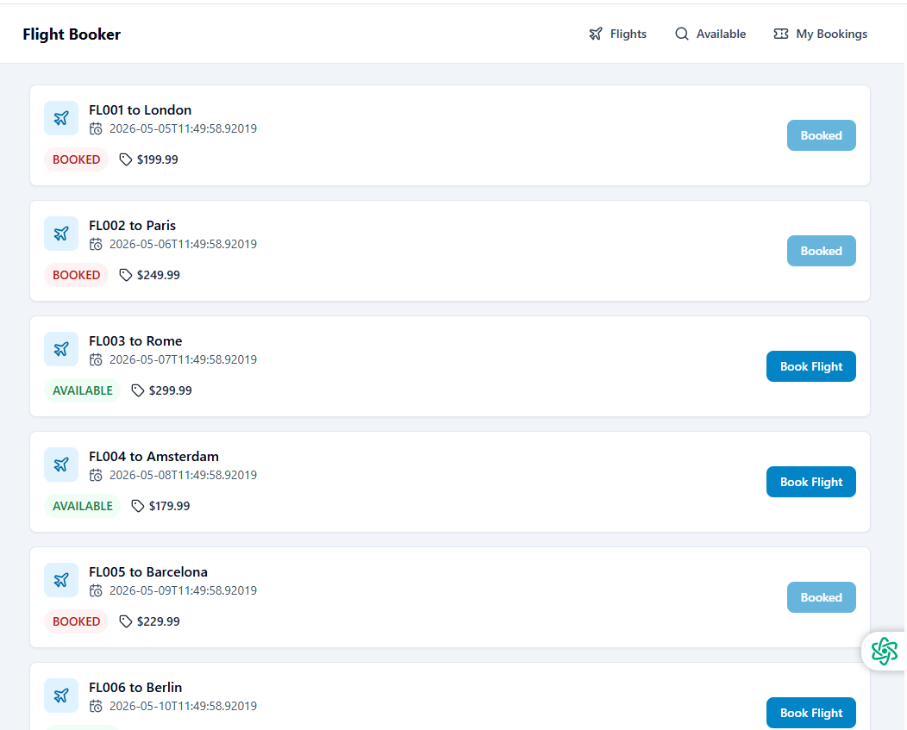
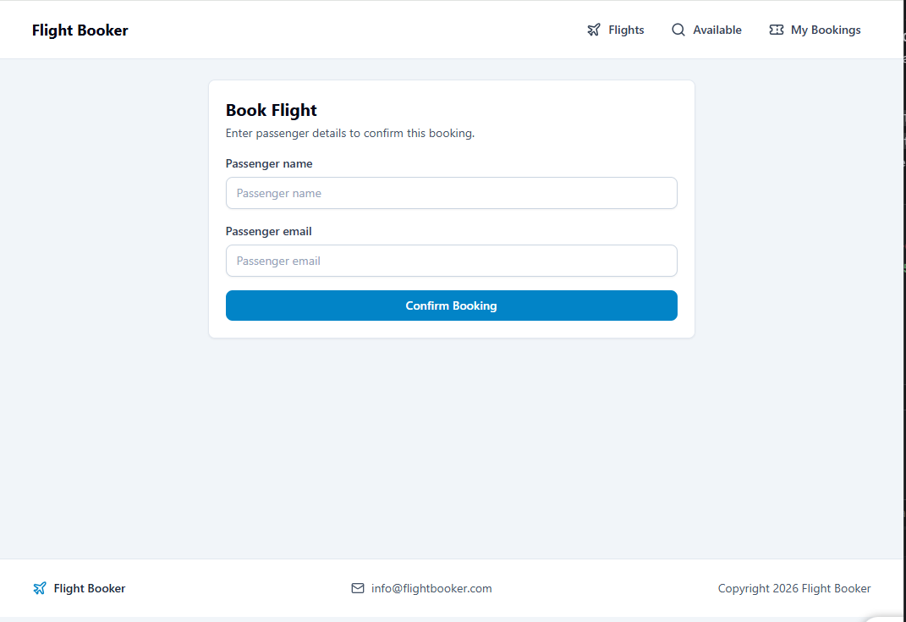
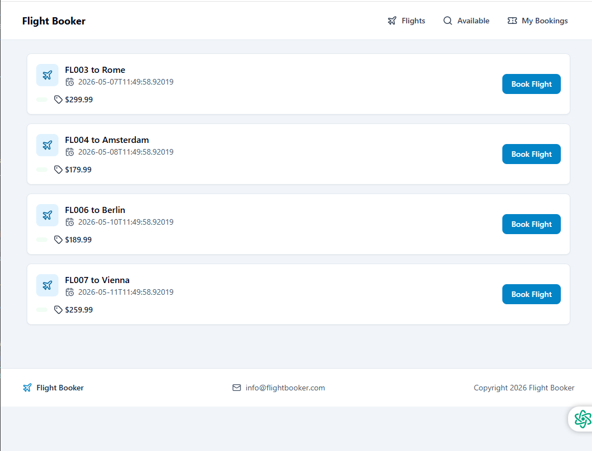
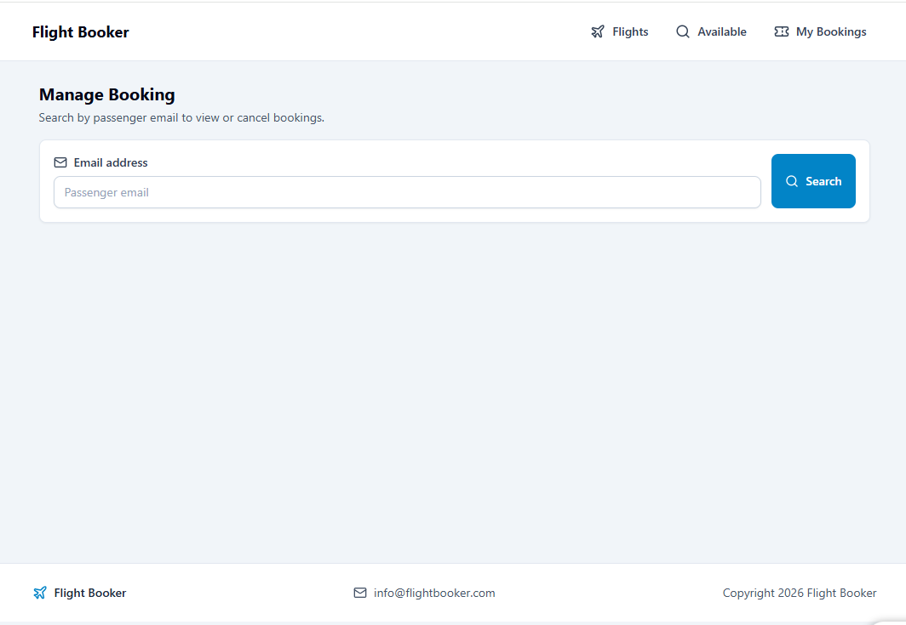

# Flight Reservation UI - Project Test

This project is based on an existing Spring Boot backend that manages flights and bookings.

Your task is to build a frontend user interface for the Flight Reservation System by consuming the provided REST API.

## Project Goal

Create a clean and usable flight booking interface where a user can:

- View all flights
- View only available flights
- Book a flight
- Search for bookings by email
- Cancel an existing booking

## Frontend Requirements

Build the UI using:

- React
- TypeScript
- React Router
- `lucide-react`
- Functional components
- React hooks

## Assignment Requirements

Your solution must include the following features.

### 1. Flights View

Create a component that fetches and displays all flights from the API.

### 2. Available Flights View

Allow the user to see only flights that are currently available for booking.

### 3. Booking Flow

Make it possible for the user to book a flight from the UI.

The booking form should collect:

- Passenger name
- Passenger email

After a successful booking, the user should receive clear feedback in the interface.

### 4. (OPTIONAL) Booking Lookup

Provide a way for the user to enter an email address and view all bookings connected to that email.

### 5.  (OPTIONAL) Cancel Booking

Allow the user to cancel a booking by using:

- Flight ID
- Passenger email

## API Endpoints

Use the backend API to power the interface.

- `GET /api/flights` - get all flights
- `GET /api/flights/available` - get available flights
- `POST /api/flights/{flightId}/book` - book a flight
- `GET /api/flights/bookings?email={email}` - get bookings by email
- `DELETE /api/flights/{flightId}/cancel?email={email}` - cancel a booking

## Getting Started

1. Run the backend application
2. Open the API documentation at `http://localhost:8080/swagger-ui.html`
3. Review the available endpoints
4. Build the frontend UI
5. Connect your components to the API

Get all flights page

Book a flight page

Get Available flights page

Get bookings by email and cancel
